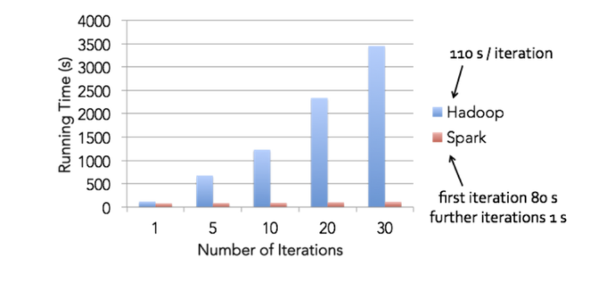
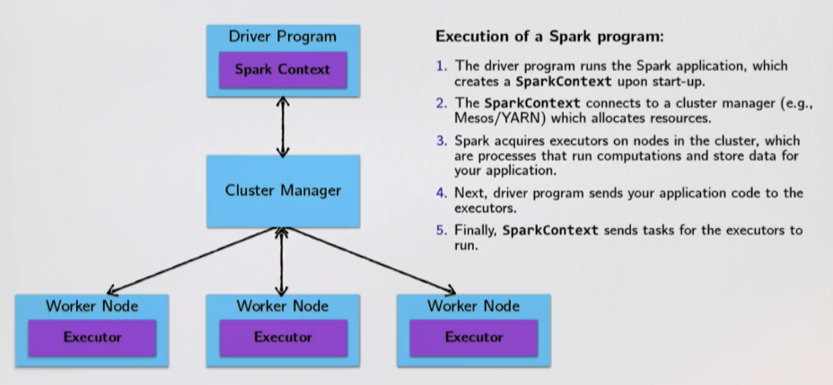

[TOC]

# Distribution

**Distribution** introduces **important concerns** beyond what we had to worry about when dealing with parallelism in the shared memory case:

1. *Partial failure*: crash failures of a subset of the machines involved in a distributed computation
2. *Latency*: certain operations have a much higher latency than other operations due to network communication


# **Why Spark?**

### Spark vs Hadoop/MapReduce

Hadoop/MapReduce: fault-tolerance in Hadoop/MapReduce comes at a cost. Between each map and reduce step, in order to recover from potential failures, Hadoop/MapReduce shuffles its data and write intermediate data to disk. (Reading/writing to disk: 100x slower than in-memory)

Latency numbers every programmer should know: <https://dzone.com/articles/every-programmer-should-know>


### Spark

1. Retains fault-tolerance
2. Different strategy for handling latency (latency significantly reduced)

**Idea:** Keep all data immutable and in-memory. All operations on data are just functional transformations, like regular Scala collections. Fault tolerance is achieved by replaying functional transformations over original dataset.

**Result:** Spark has been shown to be 100x more perfomant than Hadoop, while adding even more expressive APIs.

**Summarize:** Spark does it’s best to minimize any network traffic and turn to in-memory operations. While Hadoop/MapReduce uses on-disk & network instead.




# RDD (Resilient Distributed Datasets)

RDDs can be created in two ways:

1. Transforming an existing RDD.
2. From a SparkContext (or SparkSession) object.

SparkContext (SparkSession) is the handle to Spark cluster, two main ways to create and populate a new RDD:

1. parallelize: convert a local Scala collection to an RDD.
2. textFile: read a text file from HDFS or a local file system and return an RDD of String


## RDDs: Transformation & Actions:

Spark defines transformations and actions on RDDs:

1. Transformations. Return new RDDs as results (e.g. map, filter, flatMap)
   - They are lazy, their result RDD is not immediately computed.
2. Actions. Compute a result based on an RDD (e.g. reduce, fold), and either returned or saved to an external storage system (e.g., HDFS)
   - They are eager, their result is immediately computed.

Laziness/Eagerness is how we can limit network communication using the programming model!

## Evaluation in Spark: Unlike Scala Collections!

Despite similar-looking API to Scala Collections, the deferred semantics of Spark’s RDDs are very unlike Scala Collections, due to:

1. the lazy semantics of RDD transformation operations (map, flatMap, filter)
2. and users’ implicit reflex to assume collections are eagerly evaluated (can use caching to reduce re-evaluation)

Spark compared to Hadoop/MapReduce, works much faster for data science applications (because there are many iterations, which is in-memory, and not reading/writing from disk every time.)

### Benificial Examples

Benifits of laziness for large-scale data, Spark leverages this by analyzing and optimizing the chain of operations before executing it.

```scala
val firstLogsWithErrors = lastYearLogs.filter(_.contains("ERROR")).take(10)
```

In this scenario, Spark will not compute intermediate RDDs. Instead, as soon as 10 elements of the filtered RDD have been computed, firstLogsWithErrors is Done. At this point, Spark stops working, thus saving time and space computing elements of the unused result of filter.

```scala
val numErrors = lastYearLogs.map(.lowercase).filter(.contains("error”)).count()
```

In this scenario, after calling map and filter, Spark knows that it can avoid doing multiple passes through the data. That is, Spark can traverse through the RDD once, computing the result of map and filter in this single pass, before returning the result.

### Negative Example

```scala
var points = sc.textFile(...).map(parsePoint)
var w = Vector.zeros(d)
for (i <- 1 to numIterations) {
  val gradient = points.map(...).reduce(...)
  w -= alpha * gradient
}
```

In this scenario, due to the laziness of transformation, points is being re-evaluated upon every iteration! To deal with this, we must explicitly call `.cache()` or `.persist(PERSIST_LEVEL)` to cache it to avoid re-evaluation.


# Cluster Topology



Data are sent back-forth from driver program and worker nodes. For example, when doing a chain of executions, they will be queued up at the driver program (due to laziness evaluation), and when doing an action, the code is sent to worker node for to do some work. And then the worker nodes send their data back to the driver nodes for further work.

Note: the `println` function will be executed on worker nodes since it is an action (and not a transformation), so the outputs on stdout will only appear on worker nodes and not on driver program.

