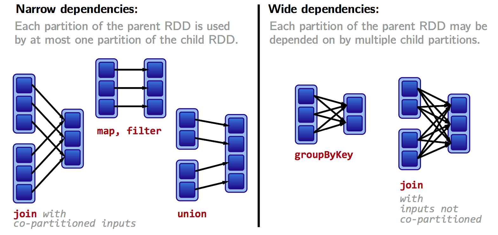

[TOC]

## Shuffling

We typically have to move data from one node to another to be “grouped” with it’s key.

In MR, It’s the phase in between of map and reduce.

Knowing that shuffling exists is very important: e.g when `reduceByKey` can be used, always avoid `groupByKey`. This is because Spark knows it can combine output with a common key on each partition before shuffling the data, thus reducing the number of data passed through network.


## Partitioning

**The data within an RDD is split into several partitions.**

Properties of partitions:

1. Partitions never span multiple machines, i.e., tuples in the same partition are guaranteed to be on the same machine.
2. Each machine in the cluster contains one or more partitions.
3. The number of partitions to use is configurable. By default, it equals the total number or cores on all executor nodes.


***Note: Customizing a partitioning is only possible on Pair RDDs.***


Two kinds of partitioning available in Spark:

1. Hash partitioning, attempts to spread data evenly across partitions based on the key
2. Range partitioning, tuples with keys in the same range appear on the same machine.


**How to set a partitioning for our data?**

1. Call `partitionBy` on an RDD, providing an expilcit Partitioner. 

```scala
val pairs = purchasesRdd.map(p => (p.customerId, p.price))
val tunedPartitioner = new RangePartitioner(8, pairs)
val partitioned = pairs.partitionBy(tunedPartitioner).persist()
```

**Important**: the resulst of  `partitionBy` should be ***persisted***. Otherwise, the partitioning is repeatedly applied (involving shuffling!) each time the partitioned RDD is used.


2. Using transformations that return RDDs with specific partitioners.

- Partitioner from parent RDD
- Automatically-set partitioners
- Note: `map` transformation does not keep the parent partitioner, since may involve changing keys. Use `mapValues` instead, it enables us to still to map transformations without changing the keys, thereby preserving the partitioner.


## Optimizing with Partitioners

Common scenarios where Network Shuffle can be avoided using Partitioning

1. `reduceByKey` running on a pre-partitioned RDD will cause the values to be computed locally, requiring only the final reduced value to be sent from worker to the driver.
2. `join` called on 2 RDDs that are pre-partitioned with the same partitioner and cached on the same machine will cause the join to be computed locally, with no shuffling across the network.


## Wide vs Narrow Dependencies

Computations on RDDs are represented as a lineage graph, a DAG representing the computations done on the RDD.

**Narrow Dependency**

- Each partition of the parent RDD is used by at most one partition of the child RDD.
- Fast! No shuffle necessary. Optimization like pipelineing possible.

**Wide dependency**

- Each partition of the parent RDD may be depended on by multiple child partitions.
- Slow! Requires all or some data to be shuffled over the network.




### Lineages Graph and Fault Tolerance

Lineages are the key to fault tolerance in Spark.

Along with keeping track of the dependency information between partitions as well, lineage DAGs allow us to: **Recover from failures by recomputing lost partitions from lineage graphs,** as it is easy to back track in a lineage graph.